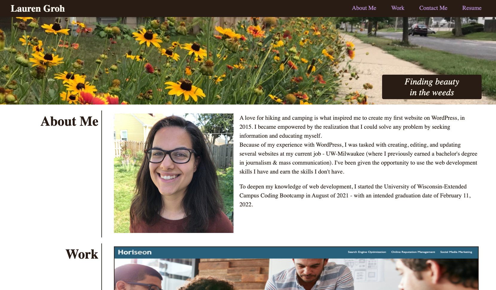

# GrohTech.github.io
My portfolio site

## TABLE OF CONTENTS
--------------------

* Introduction
* Technologies Used
* Updates
* Maintainers

## INTRODUCTION
---------------

This is my professional portfolio site, filled with information about my experience, education, and work history. Users should click all links to find more information.

**View the homepage, here:** [Lauren Groh - Portfolio Website](https://grohtech.github.io/ "Lauren Groh - Portfolio Website")

**View website screenshots, here:**

## TECHNOLOGIES USED
--------------------

* HTML
* CSS

## UPDATES
----------

**09.06.21 - Website Created**
* Created wireframe outline
* Created HTML file
* Styled with CSS
* Added photos
* Added and tested all links
* Fixed formatting issues
* Made website responsive using media queries

**09.09.21 - Bootcamp Feedback Changes**
* Added about me avatar
* Organized repo
* Added gitignore
* Fixed formatting issues
* Added additional media query
* Screenshots, below:

  

## MAINTAINERS
--------------
**Current Maintainers**
1. Lauren Groh - [GitHub](https://github.com/GrohTech "GitHub Profile")
